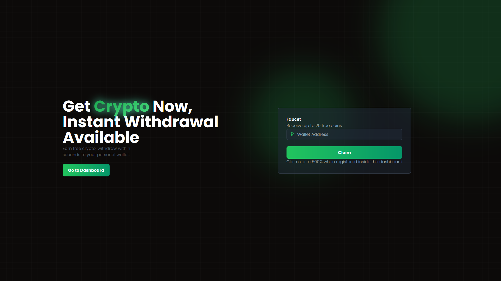
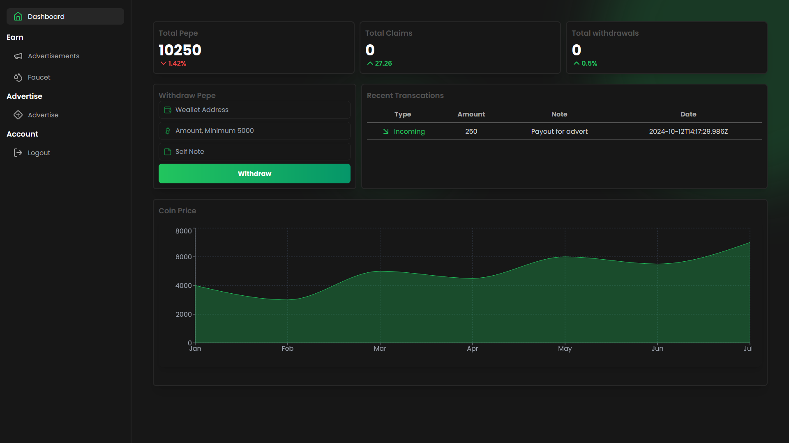
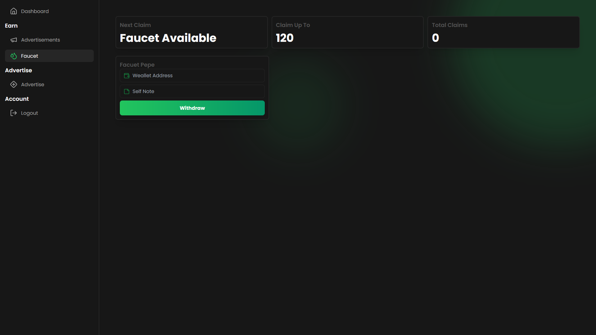

# NexAd



## Overview

**NexAd** is a framework for a CPA (Cost Per Action) and Watch-to-Earn platform where users earn *Pepe* by watching advertisements, completing surveys, and claiming rewards through an on-site faucet. Users can also pay *Pepe* to host their own ads on the platform, making it a two-way marketplace for both advertisers and viewers.

## Features

- **Watch to Earn**: Earn *Pepe* by watching ads and filling out surveys.
- **Faucet**: Claim free *Pepe* periodically through an on-site faucet.
- **Advert Hosting**: Pay *Pepe* to create and host your own ads.
- **Custom Dashboard**: Monitor earnings and advertisement stats via an interactive dashboard.
- **Crypto Integration**: Integrated with *PepeCLI* wallet for payments and rewards distribution.




---

## Tech Stack

NexAd is built with the following technologies:

- **Frontend**: React, Tailwind CSS
- **Backend**: Node.js, Express
- **Wallet**: PepeCLI Wallet for handling *Pepe* transactions
- **Email Service**: MailTrap for email delivery during testing and development

---

## Installation

1. Clone the repository and navigate to the `backend` folder:
   ```bash
   git clone <repo_url>
   cd NexAd/backend
