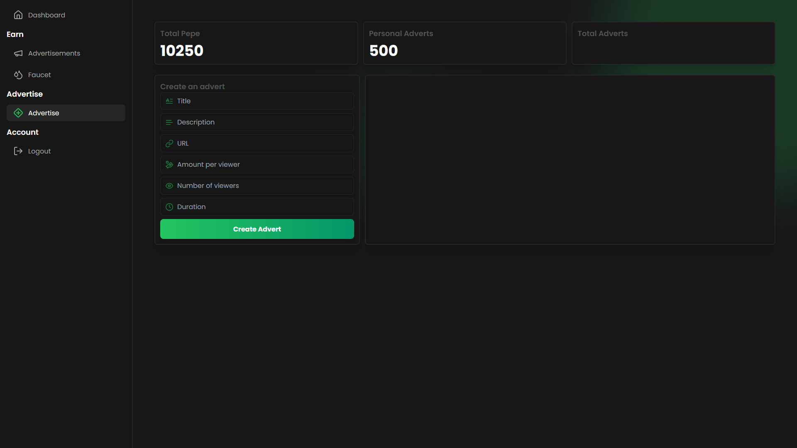
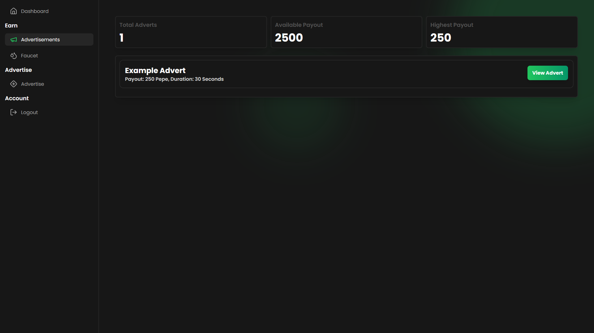

# NexAd


## Overview

**NexAd** is a framework for a CPA (Cost Per Action) and Watch-to-Earn platform where users earn *Pepe* by watching advertisements, completing surveys, and claiming rewards through an on-site faucet. Users can also pay *Pepe* to host their own ads on the platform, making it a two-way marketplace for both advertisers and viewers.

## Features

- **Watch to Earn**: Earn *Pepe* by watching ads and filling out surveys.
- **Faucet**: Claim free *Pepe* periodically through an on-site faucet.
- **Advert Hosting**: Pay *Pepe* to create and host your own ads.
- **Custom Dashboard**: Monitor earnings and advertisement stats via an interactive dashboard.
- **Crypto Integration**: Integrated with *PepeCLI* wallet for payments and rewards distribution.


---

## Tech Stack

NexAd is built with the following technologies:

- **Frontend**: React, Tailwind CSS
- **Backend**: Node.js, Express
- **Wallet**: PepeCLI Wallet for handling *Pepe* transactions
- **Email Service**: MailTrap for email delivery during testing and development

---

## Installation

1. Clone the repository and navigate to the `backend` folder:
   ```bash
   git clone <repo_url>
   cd NexAd/backend
   ```

2. Run the build script to install necessary dependencies:
   ```bash
   npm run build
   ```

3. To run the application:
   - For **development mode**: 
     ```bash
     npm run dev
     ```
   - For **production mode**:
     ```bash
     npm run start
     ```

---

## API Endpoints

### Crypto Endpoints

- **Claim from Faucet**:
  - Endpoint: `/api/crypto/faucet`
  - Method: `POST`
  - Requires a valid wallet address and Hcaptcha token to payout between 1-20 *Pepe*.

- **Faucet Dashboard**:
  - Endpoint: `/api/crypto/faucet-dashboard`
  - Method: `GET`
  - Requires an account to view, and payouts range between 1-120 *Pepe*.

### Advert Endpoints

- **Create an Advertisement**:
  - Endpoint: `/api/crypto/create-advert`
  - Method: `POST`
  - Requires an account and the following fields in the body:
    ```json
    {
      "name": "Ad Name",
      "description": "Ad Description",
      "url": "https://advertiser-site.com",
      "payout": 50,
      "viewers": 100,
      "duration": 30
    }
    ```

- **View All Advertisements**:
  - Endpoint: `/api/crypto/adverts`
  - Method: `GET`
  - Requires an account to return a list of all active ads.

- **View Advertisement by ID**:
  - Endpoint: `/api/crypto/advert/:id`
  - Method: `GET`
  - Requires an account and returns an advert by its unique ID, which can be displayed to users.

---

## Screenshots

### Advertisement Creation Page


### Advertisement Display


### Dashboard View


---

## Contributing

We welcome contributions to improve NexAd! If you'd like to contribute:

1. Fork the repo.
2. Create a new branch (`git checkout -b feature-branch`).
3. Commit your changes (`git commit -m 'Add some feature'`).
4. Push to the branch (`git push origin feature-branch`).
5. Open a pull request.

---

## License

NexAd is open-source and distributed under the MIT License. See `LICENSE` for more details.

---

## Contact

If you have any questions or issues, feel free to open an issue on GitHub or contact the project maintainers.

--- 

### Happy Earnings with NexAd! 🎉
